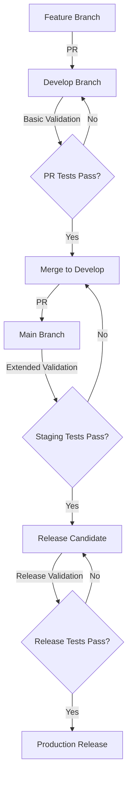

# Release Process

## Release Cycle

Our release process follows a structured approach to ensure quality and reliability:



## Branch Strategy

### Feature Branches
- Created from: `develop`
- Naming: `feature/description`
- Validation: Basic
- Merges to: `develop`

### Develop Branch
- Main integration branch
- Validation: Basic
- Contains: Latest development work
- Merges to: `main` (via PR)

### Main Branch
- Production-ready code
- Validation: Release
- Protected branch
- Source of releases

## Release Types

### 1. Patch Releases (0.0.X)
- Bug fixes
- Security patches
- No breaking changes
- Backwards compatible
- Quick release cycle

### 2. Minor Releases (0.X.0)
- New features
- Enhancements
- Backwards compatible
- Monthly release cycle

### 3. Major Releases (X.0.0)
- Breaking changes
- Major features
- Architectural changes
- Quarterly release cycle

## Release Process Steps

### 1. Preparation
1. Create release branch from develop
2. Update version numbers
3. Run extended validation
4. Update changelog
5. Review documentation

### 2. Testing
1. Run full test suite
2. Perform integration tests
3. Check code coverage
4. Validate SBOM
5. Review security scans

### 3. Release Candidate
1. Tag release candidate
2. Deploy to staging
3. Run smoke tests
4. Validate metrics
5. Review logs

### 4. Production Release
1. Merge to main
2. Create release tag
3. Generate artifacts
4. Sign binaries
5. Update release notes

### 5. Post-Release
1. Monitor metrics
2. Check error rates
3. Review logs
4. Update documentation
5. Plan next release

## Versioning

We follow [Semantic Versioning](https://semver.org/):

```
MAJOR.MINOR.PATCH
```

Example: `1.2.3`
- MAJOR: Breaking changes
- MINOR: New features
- PATCH: Bug fixes

## Release Artifacts

### Binary Artifacts
```
api-{version}-{os}-{arch}
├── api              # Main binary
├── api.sha256      # SHA-256 checksum
├── api.sha512      # SHA-512 checksum
├── api.sig         # Cosign signature
└── sbom/
    ├── spdx.json   # SPDX format SBOM
    └── cyclonedx.json # CycloneDX format SBOM
```

### Documentation
- Changelog updates
- API documentation
- Release notes
- Migration guides (if needed)

## Hotfix Process

For urgent production fixes:

1. Create hotfix branch from main
2. Apply fix
3. Run full validation
4. Create PR to both main and develop
5. Release as patch version

## Release Schedule

- Patch releases: As needed
- Minor releases: Monthly
- Major releases: Quarterly
- Security fixes: Immediate

## Release Checklist

### Pre-Release
- [ ] All tests passing
- [ ] Coverage requirements met
- [ ] Documentation updated
- [ ] Changelog updated
- [ ] Version bumped
- [ ] Dependencies audited

### Release
- [ ] Release branch created
- [ ] Release validation passed
- [ ] Artifacts generated
- [ ] Checksums verified
- [ ] Binaries signed

### Post-Release
- [ ] Deployment successful
- [ ] Monitoring in place
- [ ] Release notes published
- [ ] Tags pushed
- [ ] Notifications sent

## Rollback Procedure

If issues are detected:

1. Identify the issue
2. Notify stakeholders
3. Revert to last known good version
4. Validate system status
5. Create incident report